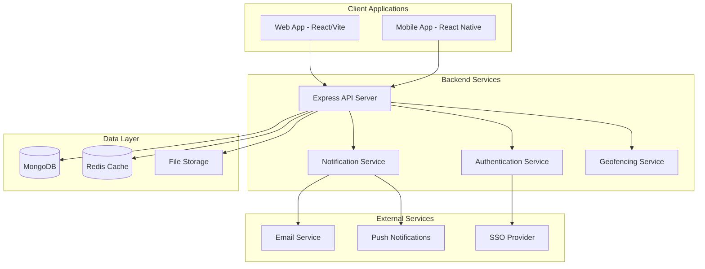

# UniOne Platform Design Document

## Overview

UniOne is designed as a modern, scalable educational platform powered by IoSC (Institute of Smart Computing) using a monorepo architecture with separate applications for web, mobile, and backend services. The platform leverages React for the web frontend, React Native for mobile, and Node.js with Express for the backend API. The system is built to handle role-based access for students, faculty, and administrators while providing real-time features like notifications and geofenced attendance tracking.

## Architecture

### High-Level Architecture



### Technology Stack

**Frontend (Web)**
- React 18 with TypeScript
- Vite for build tooling
- TailwindCSS for styling
- React Router for navigation
- TanStack Query for state management
- React Hook Form for form handling
- Headless UI for accessible components

**Mobile Application**
- React Native (to be implemented)
- Native navigation
- AsyncStorage for offline caching
- Geolocation services
- Push notification support

**Backend**
- Node.js with Express framework
- MongoDB with Mongoose ODM
- Socket.io for real-time communication
- JWT for authentication
- Multer for file uploads
- Geolib for geofencing calculations
- Express Rate Limiting for security

**Infrastructure**
- Monorepo structure with Lerna
- Docker containers for deployment
- Redis for session management and caching
- File storage for assignments and materials

## Components and Interfaces

### Core Components

#### 1. Authentication System
- **JWT-based authentication** with refresh tokens
- **Role-based access control** (Student, Faculty, Admin)
- **SSO integration** capability for university systems
- **Session management** with Redis

#### 2. User Management
- **User profiles** with role-specific data
- **Course enrollment** management
- **Permission system** for feature access
- **Audit logging** for administrative actions

#### 3. Course Management
- **Course creation** and configuration
- **Enrollment management** (bulk and individual)
- **Content organization** (announcements, materials, assignments)
- **Discussion threads** with moderation

#### 4. Attendance System
- **Geofencing engine** using GPS coordinates
- **Session management** with time-based windows
- **Manual override** capabilities for faculty
- **Attendance analytics** and reporting

#### 5. Assignment System
- **Assignment creation** with rich content support
- **File upload** and submission tracking
- **Grading interface** with rubrics
- **Plagiarism detection** integration points

#### 6. Communication Hub
- **Announcement system** with targeting
- **Real-time notifications** via WebSocket
- **Email integration** for external notifications
- **Push notifications** for mobile users

#### 7. Analytics and Reporting
- **Dashboard widgets** for key metrics
- **Report generation** with export capabilities
- **Data visualization** for trends
- **Performance tracking** across courses

### API Interface Design

#### Authentication Endpoints
```
POST /api/auth/login
POST /api/auth/refresh
POST /api/auth/logout
POST /api/auth/sso/callback
```

#### User Management
```
GET /api/users/profile
PUT /api/users/profile
GET /api/users/courses
POST /api/admin/users
DELETE /api/admin/users/:id
```

#### Course Management
```
GET /api/courses
POST /api/courses
GET /api/courses/:id
PUT /api/courses/:id
POST /api/courses/:id/enroll
```

#### Attendance
```
POST /api/attendance/sessions
POST /api/attendance/mark
GET /api/attendance/reports
PUT /api/attendance/override
```

#### Assignments
```
GET /api/assignments
POST /api/assignments
POST /api/assignments/:id/submit
GET /api/assignments/:id/submissions
POST /api/assignments/:id/grade
```

## Data Models

### User Model
```typescript
interface User {
  _id: ObjectId;
  email: string;
  password: string; // hashed
  role: 'student' | 'faculty' | 'admin';
  profile: {
    firstName: string;
    lastName: string;
    studentId?: string;
    employeeId?: string;
    department: string;
    avatar?: string;
  };
  enrolledCourses: ObjectId[]; // Course IDs
  createdAt: Date;
  updatedAt: Date;
  lastLogin: Date;
  isActive: boolean;
}
```

### Course Model
```typescript
interface Course {
  _id: ObjectId;
  code: string; // e.g., "CS101"
  name: string;
  description: string;
  instructor: ObjectId; // User ID
  semester: string;
  year: number;
  enrolledStudents: ObjectId[]; // User IDs
  settings: {
    allowDiscussions: boolean;
    geofenceRequired: boolean;
    attendanceThreshold: number;
  };
  createdAt: Date;
  updatedAt: Date;
}
```

### Attendance Model
```typescript
interface AttendanceSession {
  _id: ObjectId;
  courseId: ObjectId;
  instructorId: ObjectId;
  date: Date;
  startTime: Date;
  endTime: Date;
  geofence: {
    latitude: number;
    longitude: number;
    radius: number; // in meters
  };
  attendanceRecords: {
    studentId: ObjectId;
    status: 'present' | 'absent' | 'late';
    markedAt?: Date;
    location?: {
      latitude: number;
      longitude: number;
    };
    manualOverride?: {
      by: ObjectId; // Faculty/Admin ID
      reason: string;
      timestamp: Date;
    };
  }[];
  isActive: boolean;
}
```

### Assignment Model
```typescript
interface Assignment {
  _id: ObjectId;
  courseId: ObjectId;
  title: string;
  description: string;
  instructions: string;
  dueDate: Date;
  maxPoints: number;
  attachments: {
    filename: string;
    url: string;
    size: number;
  }[];
  submissions: {
    studentId: ObjectId;
    submittedAt: Date;
    files: {
      filename: string;
      url: string;
      size: number;
    }[];
    grade?: {
      points: number;
      feedback: string;
      gradedBy: ObjectId;
      gradedAt: Date;
    };
  }[];
  settings: {
    allowLateSubmissions: boolean;
    maxFileSize: number;
    allowedFileTypes: string[];
  };
  createdAt: Date;
}
```

### Announcement Model
```typescript
interface Announcement {
  _id: ObjectId;
  title: string;
  content: string;
  authorId: ObjectId;
  type: 'course' | 'university';
  targetAudience: {
    courseId?: ObjectId;
    roles?: ('student' | 'faculty' | 'admin')[];
    departments?: string[];
  };
  attachments?: {
    filename: string;
    url: string;
  }[];
  isPinned: boolean;
  allowComments: boolean;
  comments: {
    authorId: ObjectId;
    content: string;
    createdAt: Date;
  }[];
  createdAt: Date;
  updatedAt: Date;
}
```

## Error Handling

### Error Response Format
```typescript
interface ErrorResponse {
  success: false;
  error: {
    code: string;
    message: string;
    details?: any;
    timestamp: Date;
  };
}
```

### Error Categories
- **Authentication Errors** (401): Invalid credentials, expired tokens
- **Authorization Errors** (403): Insufficient permissions
- **Validation Errors** (400): Invalid input data
- **Not Found Errors** (404): Resource not found
- **Geofencing Errors** (422): Location validation failures
- **Server Errors** (500): Internal system errors

### Error Handling Strategy
- **Client-side**: Toast notifications for user-facing errors
- **Server-side**: Structured logging with error tracking
- **Retry logic**: For network and temporary failures
- **Graceful degradation**: Offline mode for mobile app

## Testing Strategy

### Unit Testing
- **Backend**: Jest for API endpoints and business logic
- **Frontend**: React Testing Library for components
- **Coverage target**: 80% minimum for critical paths

### Integration Testing
- **API testing**: Supertest for endpoint integration
- **Database testing**: In-memory MongoDB for isolated tests
- **Authentication flow**: End-to-end auth scenarios

### End-to-End Testing
- **User workflows**: Critical paths like attendance marking
- **Cross-platform**: Web and mobile app consistency
- **Geofencing**: Location-based feature validation

### Performance Testing
- **Load testing**: Concurrent user scenarios
- **Database optimization**: Query performance monitoring
- **Mobile performance**: Battery and data usage optimization

### Security Testing
- **Authentication**: Token validation and expiration
- **Authorization**: Role-based access verification
- **Input validation**: SQL injection and XSS prevention
- **Geofencing**: Location spoofing prevention